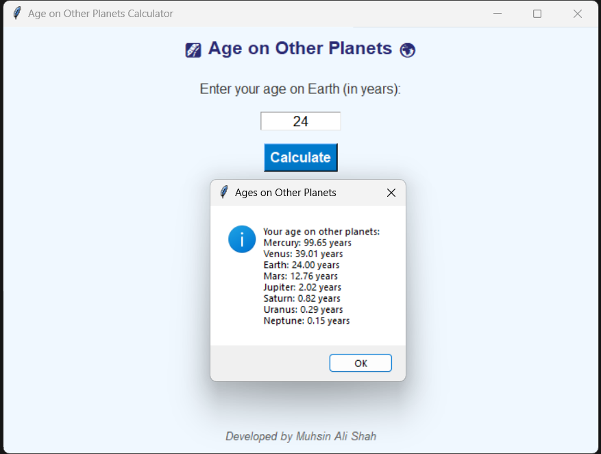

# PlanetAgeCalculator
A Python-based GUI application that calculates your age on different planets in the solar system using their orbital periods. Fun, interactive, and easy to use! 🚀🌍

# 🌌 Age on Other Planets Calculator 🌍

A fun and interactive Python application to calculate your age on different planets in the solar system based on their orbital periods relative to Earth. This GUI-based tool is designed to be user-friendly and visually appealing.

## Features
- 🖥️ **Graphical User Interface**: Built using Python's `tkinter` library for ease of use.
- 🌎 **Age Calculation**: Calculates your age on all planets in the solar system.
- 🎨 **Stylish Design**: Eye-catching colors and intuitive layout.
- 📝 **Attribution**: Developed by **Muhsin Ali Shah**.

## Preview


## How to Use
1. Clone this repository or download the script file.
2. Ensure Python is installed on your system (Python 3.x recommended).
3. Run the script using the command:
   ```bash
   python age_on_other_planets.py

git clone https://github.com/imuhsinalishah/age-on-other-planets.git
cd age-on-other-planets

Requirements
Python 3.x
No external libraries are required; uses built-in tkinter.


### Notes:
- Replace `https://github.com/imuhsinalishah/age-on-other-planets.git` with the actual GitHub repository URL.
- Add a `preview.png` screenshot of the application to the repository if you include the preview image in the README.
- Feel free to customize the file further for your preferences!
